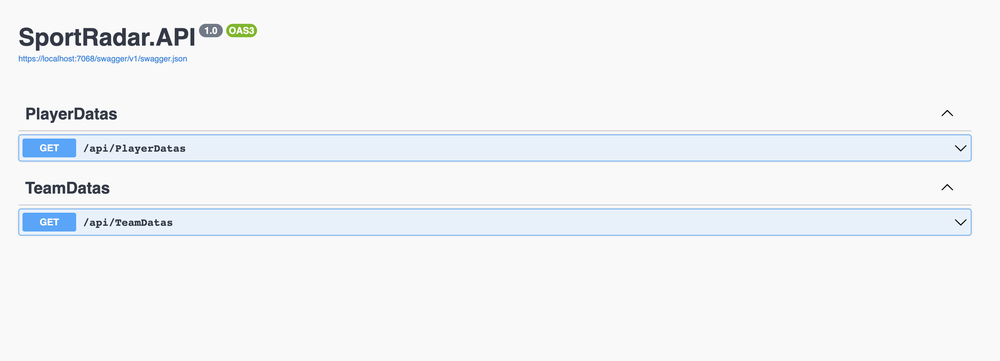

# sportradar-api-challenge
 > combine data form nhl apis to create csv files

To build this solution, download or clone the project. You can build it in Rider or any other C#/ .NET based IDE.
A web browser will open using Swagger as a UI to showcase results. 

There are two routes
* GET /api/PlayerDatas
* GET /api/TeamDatas

For GET /api/PlayerDatas
Enter two parameters : Player id and season, no spaces ex: 20142015

ex: https://localhost:7068/api/PlayerDatas?id=8476792&season=20102011

For GET /api/TeamDatas 
Enter two parameters : Team id and season, no spaces ex: 20142015

ex: https://localhost:7068/api/TeamDatas?id=5&season=20162017

* There are 12 tests included to ensure controller behavior. 
* You can run locally.

* **Team Pipeline** - Provide a team id and season year which outputs a CSV file. The CSV file includes:
  * Team ID
  * Team Name
  * Team Venue Name
  * Games Played
  * Wins
  * Losses
  * Points
  * Goals Per Game
  * Game Date of First Game of Season
  * Opponent Name in First Game of Season
* **Player Pipeline** - Provide a player id and season year which outputs a CSV file. The CSV file includes:
  * Player ID
  * Player Name
  * Current Team
  * Player Age
  * Player Number
  * Player Position
  * If the player is a rookie
  * Assists
  * Goals
  * Games
  * Hits
  * Points

